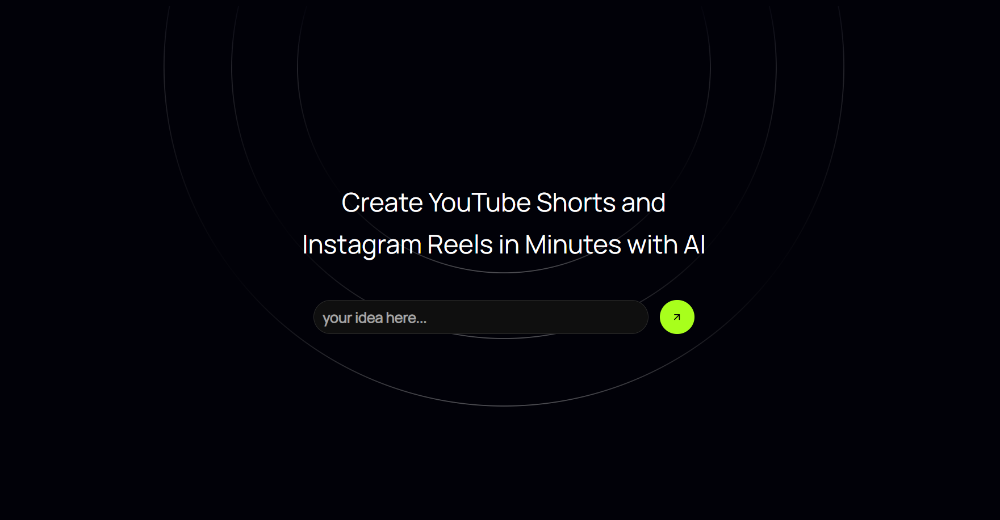
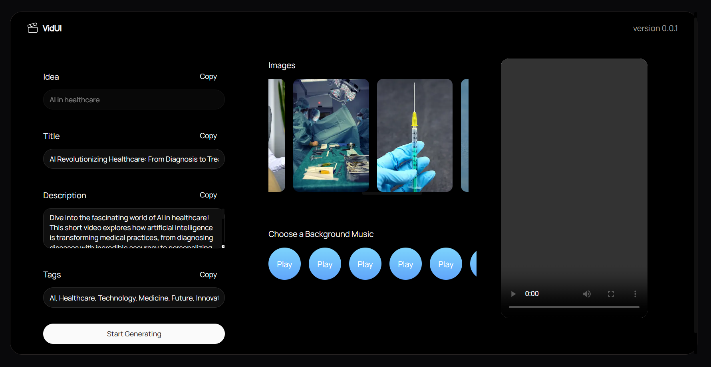

## README.md

### AI Short Video Maker

**Overview**

This project is an AI-powered short video maker that generates engaging videos from text input. It leverages Python for API interactions, text-to-audio conversion, and video generation, Next.js for the frontend user interface, and Firebase for user data management.

**Features**

* **Text-to-Video Generation:** Converts text input into visually appealing short videos.
* **AI-Powered Content Creation:** Generates text content and images based on user input.
* **Customizable Background Music:** Allows users to choose from a variety of background music options.
* **User-Friendly Interface:** Provides an intuitive Next.js-based frontend for easy video creation.
* **Secure Data Storage:** Utilizes Firebase for securely storing user data and project settings.

**Tech Stack**

* **Python:** API interactions, text-to-audio conversion, video generation
* **Next.js:** Frontend development
* **Firebase:** User data management, storage

**Screenshots**




**Installation**

1. **Clone the repository:**
   ```bash
   git clone https://github.com/your-username/ai-short-video-maker.git
   ```
2. **Install dependencies:**
   ```bash
   cd ai-short-video-maker
   npm install
   ```
3. **Set up environment variables:**
   Create a `.env.local` file in the project root and add your API keys, Firebase credentials, and other necessary environment variables.

**Usage**

1. **Run development server:**
   ```bash
   npm run dev
   ```
2. **Access the application:**
   Open your web browser and navigate to http://localhost:3000.

**Contributing**

Contributions are welcome! Please follow these guidelines:

1. Fork the repository.
2. Create a new branch for your feature.
3. Make your changes and commit them.
4. Push your changes to your fork.
5. Create a pull request.

